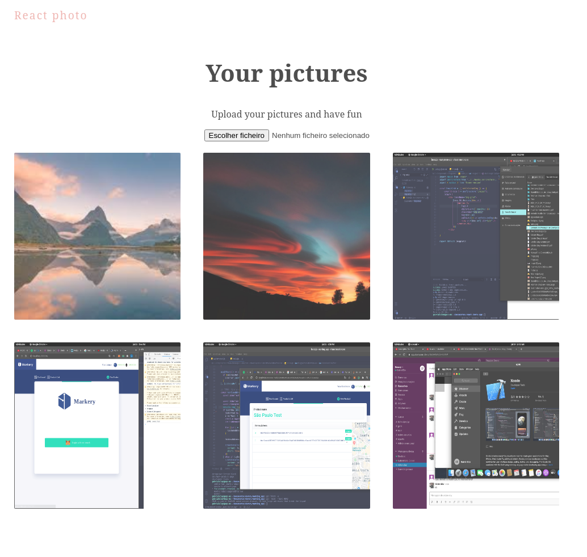

## React Photos



This project is a photo gallery made with react + firebase.
I also added some minor animations with framer motion in order to make it look good


## Running

You can download the project and use your preferred package manager to install the dependecies by running the command

```
yarn install && yarn start
```

or

```
npm i && npm run start
```

## Web link

Maybe you don't want to download this project and run it in order to see it running.
If that is your case, you can just 

<a href="https://suspicious-shaw-4564cf.netlify.app" target="_blank">click here</a>
